# Front-End Development
If you are new to FrontEnd Development, check out this repository - HTML | CSS | JavaScript

## Context
This repository demonstrates the beginning of my Front-End development journery with 'GirlDevelopIt' being one of my very first ever web pages.

## Table of Contents
- [Front-End Development](#frontenddevelopment)
- [Context](#context)
- [Table of Contents](#table-of-contents)
- [Girl Develop It](#girl-develop-it)
- [Personal Portfolio](#personal-portfolio)
- [PUBG](#pubg)

## Girl Develop It
### Overview:
When creating this project, the purpose was to gain a basic understanding of HTML as well as how HTML elements work together and the capabilities. Some of these things include:
- HTML tags `<>`
- Images
- Text boxes
- Radio buttons
- Tables 
- Submit buttons
- Drop-down menus
- Links

### Index page:
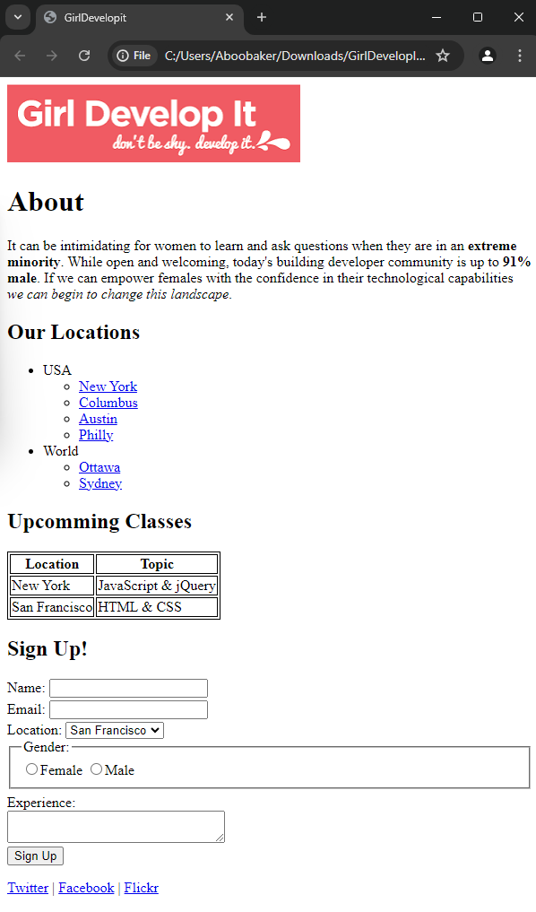

## Personal Portfolio
### Overview:
When developing this project it was basically a free for all - express yourself - type of a project, being a Personal Portfolio project. Some of the things that I've learnt from this project inclue:
- CSS for styling the HTML
- Navigation bar 
- Adding JavaScript to customize certain elements
- Forms (Contact Me page)

### Home page:
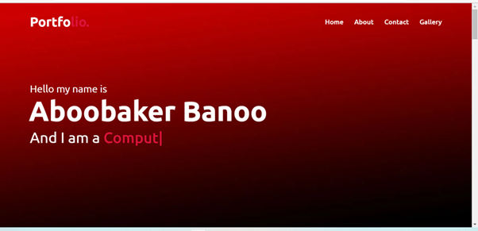

### About page:
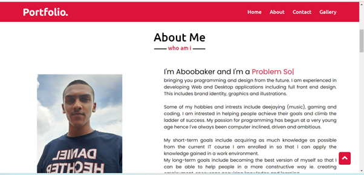

### Contact page:
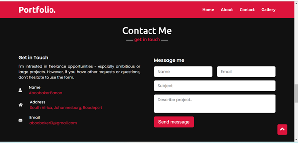

### Gallery page:
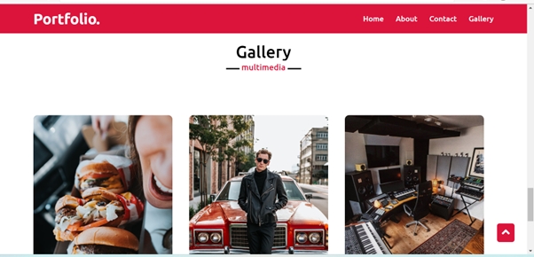

## PUBG
### Overview:
This project was about creating a Gaming Store website which highlights my favourite game at the time PUBG (PlayerUnknown's Battlegrounds). Some of the things that I've learnt from this project include:
- Logos
- Transitions
- SVGs
- Videos
- Embedding Maps
- Slide Shows
- Database for CRUD operations

### Landing page:
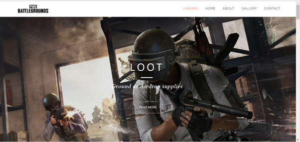

### Home page:
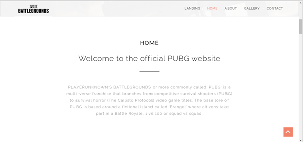 
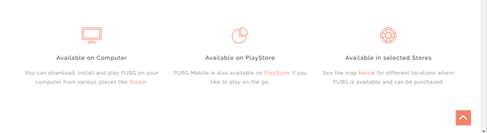

### About page:
 
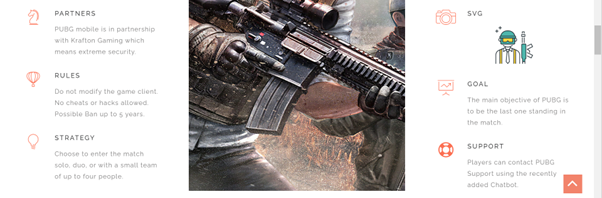 
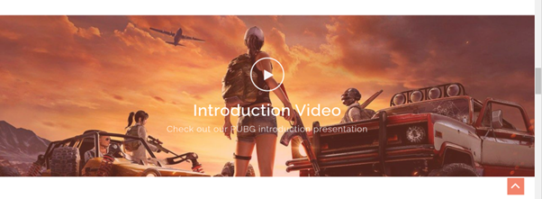

### Gallery page:
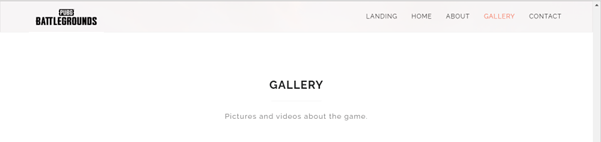 
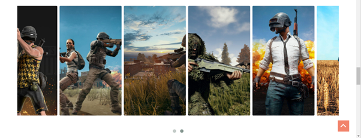 

#### Maps showing all the stores where PUBG is available:
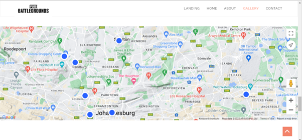

### Contact page:
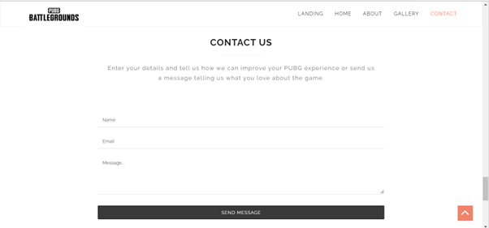 
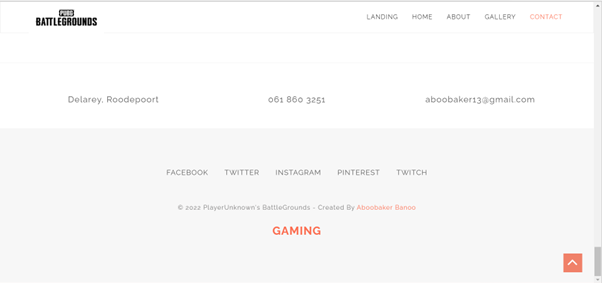

### Database (CRUD):
#### Read:
 

#### Read + Delete:
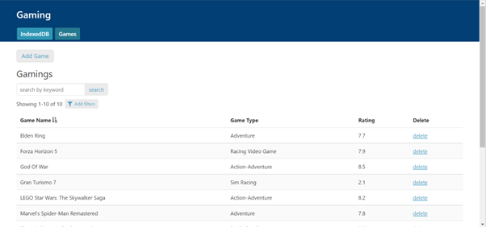 

#### Create:
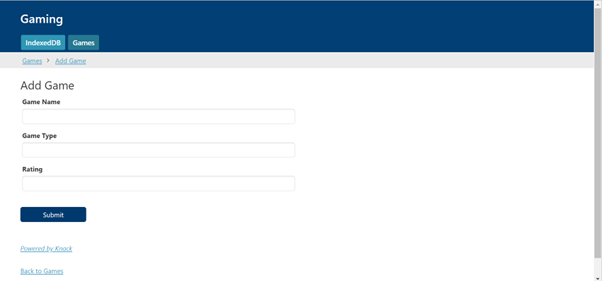

