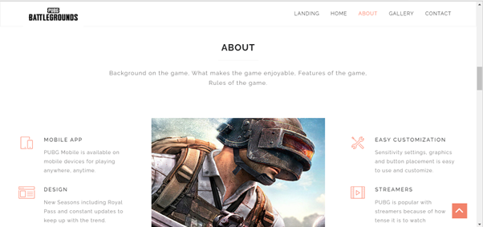
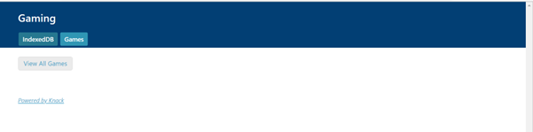

# Front-End Development
If you are new to Front-End Development, check out this repository - HTML | CSS | JavaScript

## Context
This repository demonstrates the beginning of my Front-End development journey, with 'GirlDevelopIt' being one of my very first web pages.

## Table of Contents
- [Front-End Development](#front-end-development)
- [Context](#context)
- [Table of Contents](#table-of-contents)
- [Girl Develop It](#girl-develop-it)
- [Personal Portfolio](#personal-portfolio)
- [PUBG](#pubg)

## Girl Develop It
### Overview
When creating this project, the purpose was to gain a basic understanding of HTML and how HTML elements work together. Some of the elements include:
- HTML tags `<>`
- Images
- Text boxes
- Radio buttons
- Tables 
- Submit buttons
- Drop-down menus
- Links

### Index page:

## Personal Portfolio
### Overview
This project was a free-form, self-expressive Personal Portfolio project. Some of the things I learned from this project include:
- CSS for styling HTML
- Navigation bar 
- Adding JavaScript to customize certain elements
- Forms (Contact Me page)

### Home page:

### About page:

### Contact page:

### Gallery page:

## PUBG
### Overview
This project involved creating a Gaming Store website featuring my favorite game at the time, PUBG (PlayerUnknown's Battlegrounds). Some of the things I learned from this project include:
- Logos
- Transitions
- SVGs
- Videos
- Embedding Maps
- Slide Shows
- Database for CRUD operations

### Landing page:

### Home page:
 

### About page:
 
 

### Gallery page:
 
 

#### Maps showing all the stores where PUBG is available:

### Contact page:
 

### Database (CRUD):
#### Read:
 

#### Read + Delete:
 

#### Create:

